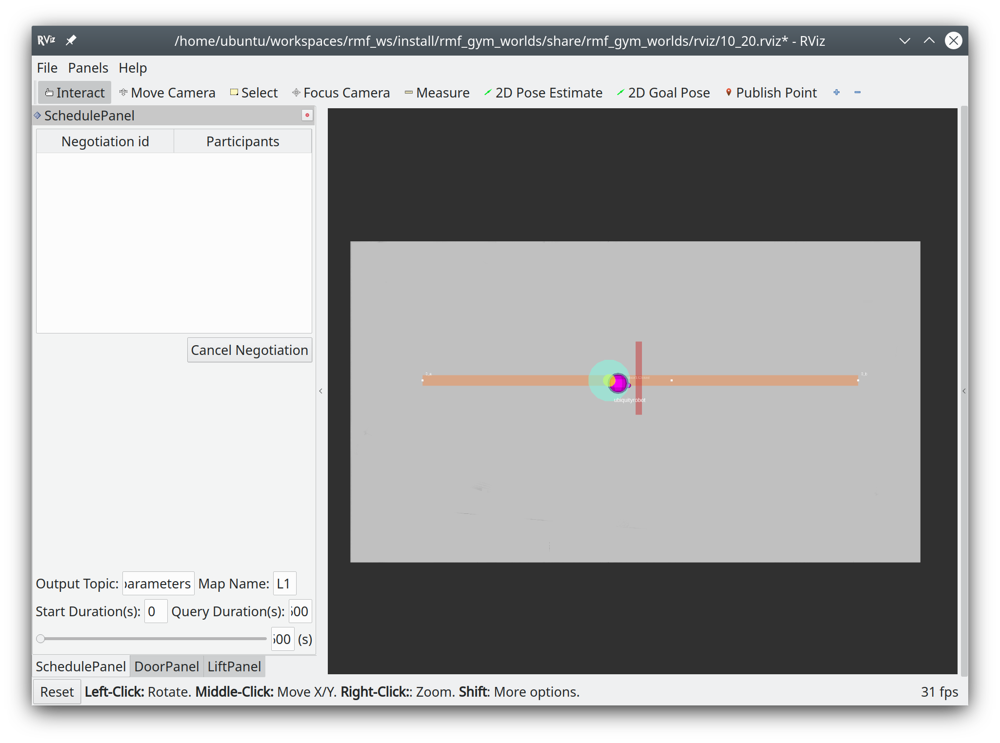

# Aligning Coordinate Frames

Right now, the free fleet client is reporting its position according to its own coordinate frame, but the server is expecting positions in its "own" frame ( as referenced in the traffic editor ).

The [transformation parameters](https://github.com/open-rmf/free_fleet/blob/main/ff_examples_ros2/launch/fake_server.launch.xml#L26-L29) describe a rigid 2D transformation between the two frames, so that we can correctly report the robot position in the RMF "frame of reference".

We will have to compute this for our specific use case.

## Aligning to the simple_door world
We will use the `simple_door` world for integration. As an example, we will be aligning the [`map.png`](./map.png) map of the OSRC-SG office and aligning it to the blank floorplan of `simple_door`.

You should have a look at the [`Magni Map`](./map.png) and the [Base Floor Plan](/rmf_gym_worlds/simple_door/maps/simple_door.png) ( which is just an empty map ).

The core idea is to use three corresponding pairs of points on each map to compute the transformation parameters needed to map points on the Magni map to points on the Base Floor Plan.

### Open The Simple Door world in traffic editor
```
traffic-editor
```

### Pick 3 points on this map
In this example, we will pick point `0_a`, the vertex left of the door, and `0_b`. All these values are in m.,
```
simple_door_points = [[3.42, -6.61], [12.29, -6.61], [24.11, -6.61]]
```

We then pick three points that we want to correspond to these points. You can do this by opening rviz on the Magni navstack,
and then click "publish point" and hover over the three points, and write down those x,y values.
```
real_map_points = [[6.94, 7.44], [11.2, 9.11], [15.4, 10.8]]
```

### Compute the transformation
Install dependencies:
```
# Install the nudged library
pip3 install nudged
```

Run the following in python interpreter:
```
import nudged
simple_door_points = [[3.42, -6.61], [12.29, -6.61], [24.11, -6.61]]
real_map_points = [[6.94, 7.44], [11.2, 9.11], [15.4, 10.8]]
trans = nudged.estimate( simple_door_points, real_map_points )

print("Translation   : ", trans.get_translation())
print("Rotation      : ", trans.get_rotation())
print("Scale         : ", trans.get_scale())
```

In this case, we get the following values:
```
Translation   :  [4.724449749360131, 9.658703299511457]
Rotation      :  0.3782711363611946
Scale         :  0.43689026310395274
```

We will thus change [the transform parameters](https://github.com/open-rmf/free_fleet/blob/main/ff_examples_ros2/launch/fake_server.launch.xml#L26-L29) accordingly in the free fleet server configuration launch file:

```
   <param name="translation_x" value="4.724"/>
    <param name="translation_y" value="9.658"/>
    <param name="rotation" value="0.378"/>
    <param name="scale" value="0.468"/>
```
A sample free fleet server launch file is [here](/rmf_gym_worlds/adapters/magni_free_fleet_sever.launch.xml).

### Sanity Check
We should now check if we have done everything correctly.

On the Magni, launch the free fleet client. For example:
```
roslaunch magni_nav_ros1 free_fleet_client.launch.xml
```

On your workstaion, launch the free fleet server. For example:
```
ros2 launch rmf_gym_worlds magni_free_fleet_server.launch.xml
```

Now, launch the `simple_door` world, without using sim time:
```
ros2 launch rmf_gym_worlds simple_door.launch.xml use_sim_time:=false
```

You should hopefully see the following beautiful sight:

