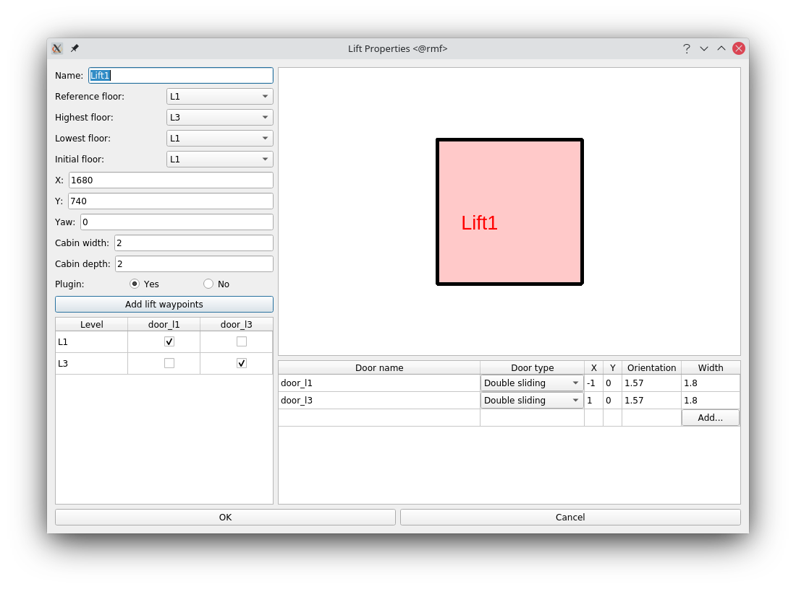

# Modify Building File for Simple Lift World
Here we show, step by step, how to modify the Base World into the Simple Lift World.

Open the traffic editor:
```
# Source ROS2 and your workspace
traffic-editor rmf_gym_worlds/worlds/simple_lift/maps/simple_lift.building.yaml
```

We will be using the [Traffic Editor Section](https://osrf.github.io/ros2multirobotbook/traffic-editor.html) for reference.

Always make sure that your graphs are fully connected, and not just look like it. A common mistake is having two overlapping vertices, instead of one vertex joining two edges:
```
A-B B'-C      # bad
A-B-C         # Good
```

### Understand Terminology
Have a look at the [GUI layout](https://osrf.github.io/ros2multirobotbook/traffic-editor.html#gui-layout) to understand terminology when referencing parts of the editor.

### Delete Graph 1
There are two Graphs, 0 and 1. You can see this by the two lane colors. Lets remove all annotations for Graph 1.
```
# Look at sidebar for the word "traffic"
# Select [traffic > Graph 0] and uncheck the Graph 0 checkbox to hide these lanes
# Select [traffic > Graph 1] ( The row should now be highlighted )
# Select the Graph 1 lane ( blue vertical bar )
# Press Del on your keyboard
# Select the two vertices it was connected to
# For each of these vertices, press Del
# Select [traffic > Graph 0] and uncheck the Graph 0 checkbox to show Graph 0 again
```

### Partially Delete Graph 0
We will remove the rightmost lane, since we will be placing this on a different level.

### Add Level 3
Have a look at how to add a 
* [vertex](https://osrf.github.io/ros2multirobotbook/traffic-editor.html#adding-a-vertex)
* [level](https://osrf.github.io/ros2multirobotbook/traffic-editor.html#adding-a-level)
* [measurements](https://osrf.github.io/ros2multirobotbook/traffic-editor.html#adding-a-measurement) 
* [fiducials](https://osrf.github.io/ros2multirobotbook/traffic-editor.html#adding-fiducials)
* [walls](https://osrf.github.io/ros2multirobotbook/traffic-editor.html#adding-a-wall)
* [floors](https://osrf.github.io/ros2multirobotbook/traffic-editor.html#adding-a-floor)

```
# Add a new level L3 with elevation 20. Use the same simple_lift.png use we for L1
# If you look at the sidebar, we will see that the X and Y are NaN. This is expeccted since we have not annotated measurements and fiducials.
# Next, annotate the measurements in the same way as L1.
# Next add walls and floor in the same way as L1.
# Add fiducials, making sure corresponding pairs on each level have the same name. For example, select the top left corner and bottom right corner on L1 and L3, then name both top left fiducials "fid_0" and bottom bottom right "fid_1". You might have to zoom in a bit to select the fiducials
# Restart traffic editor, and now the sidebar should not have NaN values anymore.
```


### Add a Lift
Have a look on how to add a [lift](https://osrf.github.io/ros2multirobotbook/traffic-editor.html#adding-a-lift).

```
# On the sidebar, click the lifts tab and [Edit]
# Click "add lift waypoints" to generate a waypoint centered in the lift, that is consistent across all levels
# Modify the configuration to look like the given image below
# You might need to click "ok" once before the lift annotation loads on the floor plan
# You should play around to understand how the lift configuration panel works
# Make sure the name of the lift has the word "lift" in it
```


### Restore the deleted Graph 0 on Level 3
```
On Level 3, annotate the lane from the lift to the rightmost endpoint, giving it a name.
```
